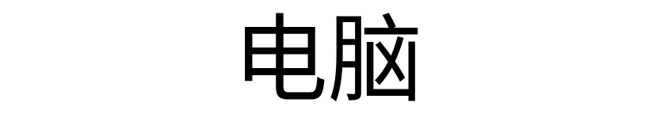
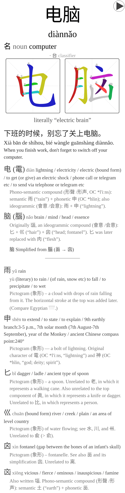
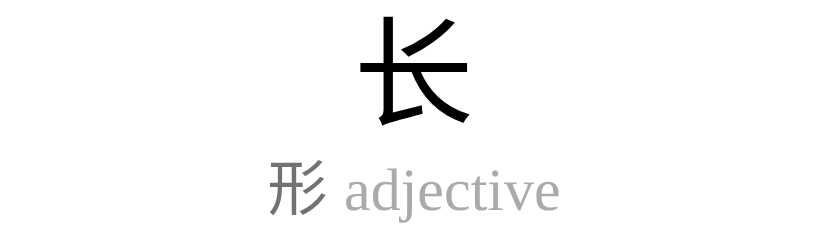
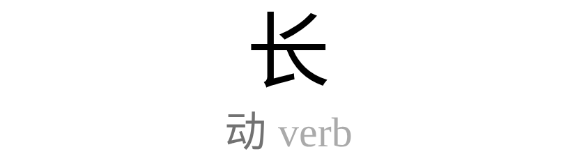
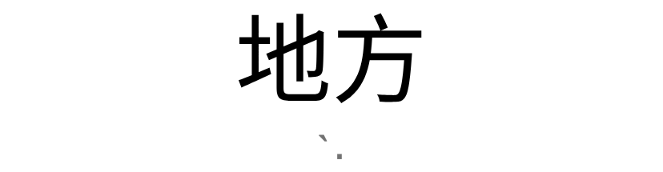
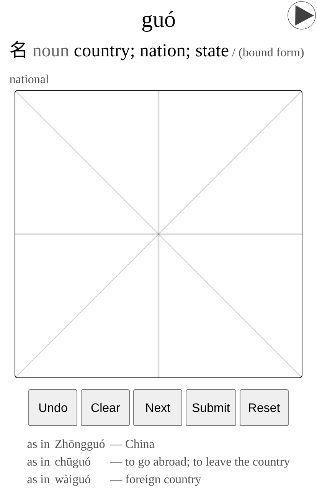
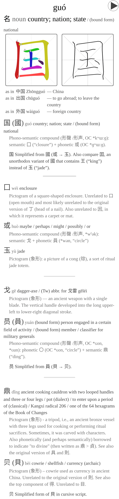
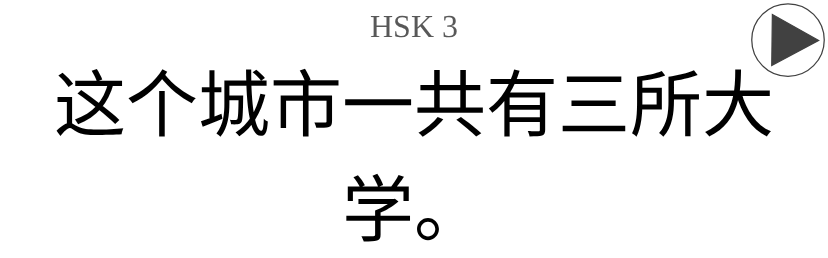
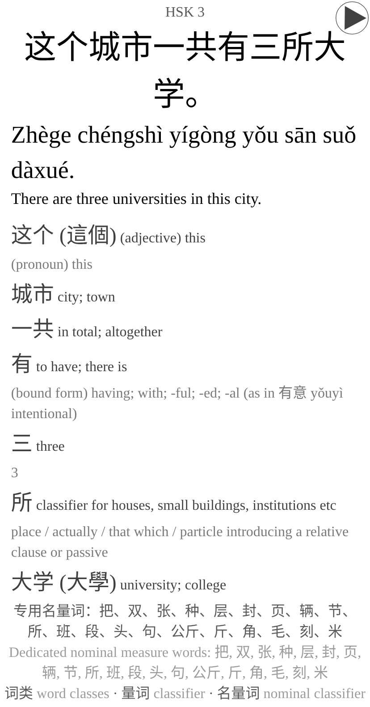

# HSK 3.0 (2025) Anki deck

An [Anki](https://apps.ankiweb.net/) deck for
[HSK 3.0 (2025)](https://en.wikipedia.org/wiki/Zhongwen_Shuiping_Kaoshi#HSK_3.0_(2025)),
the 2025 revision of the Chinese proficiency syllabus.

    ./build.sh

writes `build/HSK-3.0-2025.apkg`, about 240 MB of which nearly all is audio.

## What is in it

| cards      | how many | what they are                                         |
|------------|----------|-------------------------------------------------------|
| vocabulary | 10,999   | every word of the syllabus                            |
| writing    | 1,200    | the characters the syllabus asks you to write by hand |
| grammar    | 2,038    | one card for each official example sentence           |

The vocabulary is 300 words at level 1, 200 at 2, 500 at 3, 1,000 at 4, 1,600
at 5, 1,800 at 6 and 5,599 at 7-9, which is how the syllabus sets them out.

The pictures below are made from the built package by
`scripts/render-cards.py`, at the width of a phone, so they say what the cards
look like now rather than when somebody last took a screenshot.

A **vocabulary card** asks the word and nothing besides. It answers with the
reading, a recording, what the word means under each part of speech the
syllabus gives it, its stroke order, what it says literally where that is worth
saying -- 电脑 is an electric brain -- a sentence that uses it, and then each of
its characters glossed by the sense it carries in this word, followed by the
parts those characters are built from.

Of the eleven thousand words, 198 are written like another one, and those fronts
say which of the two is being asked for by whatever gives least away. The part
of speech does for 135 of them, since naming it says nothing about the sound:
长 is asked for as the adjective cháng or as the verb zhǎng. The tones do for 49
more, where both entries are the same part of speech, as 地方's two nouns are.
Then the level each is taught at, and where two cards share even that, which of
them this is.

A **writing card** gives the meaning and the reading and asks you to write the
character in the box, with the words it is met in named underneath by their
reading alone, since their characters would give the answer away. The back sets
what you drew beside the strokes in their order, tells the glyph's history and,
where the character is simplified, how it came to be written that way, then
explains each part it is built from as fully as the character itself. What you
draw lives only in the session that drew it, so the right-hand box below is a
tracing standing in for it.

A **grammar card** shows one sentence and plays it, then answers with the
reading, the translation, the pattern it is an example of, and a gloss of every
word in it, each leading with the sense it carries in this sentence -- 所 here
is the classifier for institutions, not the place -- and linked to the entry it
came from.

## Building

`build.sh` fetches what it needs into `data/raw` and `.cache` -- the kaikki
Wiktionary dump, CC-CEDICT from MDBG, the CHISE IDS data, the audio-cmn
recordings and makemeahanzi's stroke diagrams -- and then runs the five
numbered scripts in order. It wants `curl`, `git`, and Nix for the one step
that needs genanki, jieba and pypinyin. The first build is a slow one: the
Wiktionary dump alone is 1.2 GB and the recordings another 300 MB.

| variable                                  | what it is for                                         |
|-------------------------------------------|--------------------------------------------------------|
| `HSK_DECK_ROOT`                           | the deck the package builds into, `HSK 3.0` by default |
| `MAKEMEAHANZI`                            | a makemeahanzi checkout to use instead of cloning one  |
| `AZURE_SPEECH_KEY`, `AZURE_SPEECH_REGION` | for `scripts/tts.py` alone                             |
| `DEEPL_API_KEY`                           | for the two translate scripts alone                    |

Set `HSK_DECK_ROOT` to wherever a collection already keeps the deck --
`Language::Chinese::HSK 3.0`, say -- before building a package to import
there. An import creates every deck a package names, so building with the
wrong root leaves a second, empty tree beside the real one.

## The pipeline

- `01_wiktionary_index.py` indexes the dump: which senses are current, and what
  each character's glyph origin says.
- `02_build_words.py` merges two independent extractions of the syllabus into
  one word table -- they agree on 10,940 words, which it asserts rather than
  trusts -- and settles each word's traditional form.
- `03_media.py` matches a recording to the reading the card teaches, not to the
  spelling, and stages the stroke diagrams.
- `04_build_apkg.py` writes the package, with fixed note ids, so re-importing
  updates the notes already in a collection instead of duplicating them.
- `05_verify.py` checks the result.

The rest of `scripts/` runs when a source changes rather than on every build:
`fetch-grammar.py` and `fetch-glyph-origins.py` take the grammar syllabus from
chinesetest.cn and the glyph origins from Wiktionary, `translate-grammar.py`
and `translate-points.py` draft English with DeepL, `tts.py` voices what no
recording covers, `trim-silence.py` cuts the silence off the clips,
`make-font-subset.py` cuts a font down to the rare glyphs the cards show,
`audit-grammar-pinyin.py` reports every word the sentences read two ways, and
`render-cards.py` takes the pictures above out of the built package.

## What is decided by hand

What the sources cannot settle is written down in `data/`, so that a judgement
is a line in a diff rather than a rule buried in code.

- `sense-pos.csv` divides an entry's senses between the parts of speech the
  syllabus gives the word: 可以 is 动、形, and which of "can, may, possible,
  able to, not bad, pretty good" is the adjective is written here.
- `homograph-glosses.csv` divides one dictionary entry between two cards
  written alike, so 本 the classifier does not teach 本 the root as well.
- `sentence-word-glosses.csv` says which sense a word carries in a particular
  sentence, where nothing else can: 游 in 游游泳 is the swimming, not the
  touring.
- `grammar-pinyin.csv` is the reading of every example sentence, written to the
  convention in `grammar-pinyin-convention.md`, since reading a sentence
  character by character gets every homograph wrong.
- `reading-fixes.csv` and `pinyin-overrides.csv` correct the syllabus where the
  dictionaries agree it is wrong.
- `traditional-overrides.csv` settles a simplified form that has two
  traditional ones; `traditional-fixes-goldset.csv` is what the automatic
  choice is scored against.
- `grammar-fixes.csv` and `glyph-origin-fixes.csv` correct a fetched source at
  the point it is fetched, so that a re-fetch cannot quietly undo them.
- `swac-index.csv` says what each recording actually says, which is not always
  what it is filed under.

## Verification

`05_verify.py` refuses a package that disagrees with its sources: the word
counts against the official syllabus, the traditional forms against the gold
set, every sense of a divided entry claimed exactly once and matched verbatim,
every recording saying the reading its card teaches, every media file
referenced and every reference resolving, and the tone marks where the rules
put them.

## Sources

- [hsk-2025-data](https://github.com/chelsea6502/hsk-2025-data) and
  [hsk-syllabus-vocabulary-parser](https://github.com/Punpuf/hsk-syllabus-vocabulary-parser),
  the two extractions of the syllabus the word list is merged from
- [chinesetest.cn](https://www.chinesetest.cn/) for the grammar syllabus and its
  example sentences
- [CC-CEDICT](https://cc-cedict.org/) (CC-BY-SA) for the meanings
- [Wiktionary](https://en.wiktionary.org/) (CC-BY-SA) for the glyph origins
- [Shtooka/Yue Tan](https://github.com/hugolpz/audio-cmn) (CC-BY-SA) for the
  recordings
- [makemeahanzi](https://github.com/skishore/makemeahanzi) for the stroke
  diagrams (Arphic Public License, after the Arphic fonts) and its character
  data (LGPL)
- [DeepL](https://deepl.com) for the grammar translations
- [CHISE IDS](https://github.com/cjkvi/cjkvi-ids) (GPLv2), read while building
  and not carried into the deck: it says what shapes a character breaks down
  into. Wiktionary names the parts a card shows; this only answers whether the
  character carries the shape named.

*Programmed with [Claude Code](https://claude.ai/code)*
